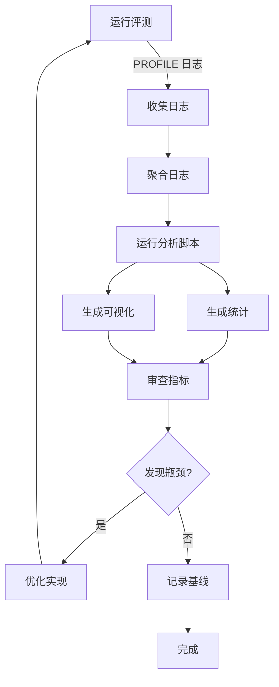

# Tau2-Bench 性能分析实验记录

**实验日期**: 2025-12-24  
**实验者**: AI Assistant  
**实验目标**: 建立完整的性能分析基础设施，并对 ToolOrchestra 进行全量评测（278 任务），获取详细的性能指标分布

---

## 📋 实验概述

本实验对 tau2-bench 评测框架进行了重大升级，引入了细粒度的性能分析能力，并完成了首次全量评测。主要成果：

1. ✅ **新增 PROFILE 日志系统**: 精确到毫秒的性能追踪
2. ✅ **vLLM 推理分析**: 分离 prefill (TTFT) 和 decode 时间，记录 token 长度
3. ✅ **自动化分析工具**: 支持多 log 聚合、10-bin 分布、可视化
4. ✅ **全量评测完成**: 278 任务（retail + telecom + airline），max_concurrency=48
5. ✅ **性能基线数据**: 7 个关键指标的统计分布

---

## 2. 技术实现

### 2.1 日志系统升级

#### 1.1 自定义日志级别

**文件**: `tau2/utils/logging_config.py`

**修改内容**:
- `PROFILE = 15`: 介于 DEBUG (10) 和 INFO (20) 之间，用于性能分析
- `USER_JUDGE = 16`: 独立于 PROFILE，用于记录评测框架自身的 LLM 调用

**关键代码**:
```python
PROFILE = 15
USER_JUDGE = 16

logging.addLevelName(PROFILE, "PROFILE")
logging.addLevelName(USER_JUDGE, "USER_JUDGE")
```

**使用方法**:
```bash
# 启用 PROFILE 日志
python run_local.py --agent-model $CKPT_DIR --log-level PROFILE
```

#### 1.2 结构化日志格式

**记录的事件类型**:
- `type=llm_call`: Agent 主模型推理
- `type=expert_call`: Expert 模型调用（通过 call_expert）
- `type=tool_call`: 本地 Python 函数执行
- `type=step_complete`: 完整 step 耗时
- `type=user_sim`: User simulator 调用
- `type=evaluator`: LLM-as-judge 调用

**日志格式示例**:
```
[PROFILE] 2025-12-24 04:28:25.388 task=impossible_task_1 thread=124685400381120 type=llm_call step=1 model=/workspace/ckpt/nvidia/Nemotron-Orchestrator-8B call_type=vllm duration_ms=2107.20 toolorchestra_vllm_infer_ms=2101.88 toolorchestra_vllm_prefill_ms=102.07 toolorchestra_vllm_decode_ms=1999.81 toolorchestra_vllm_prefill_len=857 toolorchestra_vllm_decode_len=140 has_tool_calls=False
```

### 2. vLLM Streaming 性能分析

#### 2.1 实现 TTFT (Time To First Token) 测量

**文件**: `ToolOrchestra/LLM_CALL.py`

**核心机制**:
```python
# 仅在 PROFILE/DEBUG 级别开启 streaming
if tau2_stream_profile:
    req_start = time.perf_counter()
    response = client.chat.completions.create(
        model=model,
        messages=messages,
        stream=True,  # 开启流式输出
        ...
    )
    
    first_token_ts = None
    chunks = []
    for chunk in response:
        if first_token_ts is None and chunk.choices[0].delta.content:
            first_token_ts = time.perf_counter()  # 记录首 token 时间
        chunks.append(chunk)
    
    end_ts = time.perf_counter()
    
    # 计算各项指标
    toolorchestra_vllm_infer_ms = (end_ts - req_start) * 1000
    toolorchestra_vllm_prefill_ms = (first_token_ts - req_start) * 1000
    toolorchestra_vllm_decode_ms = toolorchestra_vllm_infer_ms - toolorchestra_vllm_prefill_ms
```

**记录的指标**:
- `toolorchestra_vllm_infer_ms`: 总推理时间
- `toolorchestra_vllm_prefill_ms`: Prefill 时间 (TTFT)
- `toolorchestra_vllm_decode_ms`: Decode 时间
- `toolorchestra_vllm_prefill_len`: Prompt tokens 数量
- `toolorchestra_vllm_decode_len`: Completion tokens 数量

#### 2.2 选择性开启策略

**重要设计原则**:
- ✅ **仅对主 Agent 模型开启**: 只记录 Orchestrator-8B 的推理
- ✅ **仅在 PROFILE/DEBUG 开启**: 避免影响正常评测性能
- ✅ **向后兼容**: 不影响其他 LLM 调用路径

**文件**: `tau2/utils/llm_utils.py`

```python
# 仅当主模型是 Orchestrator-8B 且 log level 是 PROFILE/DEBUG 时开启
if "orchestrator" in model.lower() and "8b" in model.lower():
    tau2_stream_profile = tau2_logger.isEnabledFor(PROFILE)
    # 调用支持 streaming 的 get_llm_response
```

### 3. 日志文件管理

#### 3.1 双日志系统

**设计**:
1. **`eval_{domain}.log`**: 原始 stdout/stderr，包含所有输出
2. **`tau2_{domain}.log`**: 结构化 PROFILE/USER_JUDGE 日志，易于解析

**实现** (`run_local.py`):
```python
# 设置结构化日志文件路径
env["TAU2_LOG_FILE"] = os.path.join(args.log_dir, f"tau2_{domain}.log")

# 同时写入 eval_*.log 和 stdout
eval_log = open(os.path.join(args.log_dir, f"eval_{domain}.log"), "a", buffering=1)
```

**优势**:
- ✅ 实时写入，中断不丢数据
- ✅ 结构化日志易于自动化分析
- ✅ 原始日志保留完整上下文

### 4. 分析工具

#### 4.1 日志解析和统计

**文件**: `analyze_timing_from_tau2_log.py`

**核心功能**:
```bash
python analyze_timing_from_tau2_log.py \
  --log-dir logs/full_c48_profile_20251224_052421 \
  --log-glob "tau2_*.log" \
  --out-dir logs/full_c48_profile_20251224_052421 \
  --out-prefix full_c48_profile \
  --bins 10
```

**参数说明**:
- `--log-dir`: 包含多个 `tau2_*.log` 的目录（支持聚合）
- `--log-glob`: Log 文件匹配模式（默认 `tau2_*.log`）
- `--bins`: 直方图 bin 数量（默认 10）
- `--out-prefix`: 输出文件前缀

**输出**:
1. **JSON 统计文件**: `{prefix}_stats.json`
   - 包含 n, mean, std, min, max
   - 包含完整的直方图数据（edges, counts, percent）

2. **7 个 PNG 图表**: 每个指标一张
   - `{prefix}_tool_call.png`: 本地 Python tool calls
   - `{prefix}_expert_call.png`: Expert LLM API calls
   - `{prefix}_toolorchestra_vllm_infer.png`: vLLM 总推理时间
   - `{prefix}_toolorchestra_vllm_prefill.png`: vLLM prefill (TTFT)
   - `{prefix}_toolorchestra_vllm_decode.png`: vLLM decode 时间
   - `{prefix}_toolorchestra_vllm_prefill_len.png`: Prompt tokens 长度
   - `{prefix}_toolorchestra_vllm_decode_len.png`: Completion tokens 长度

3. **控制台输出**: 7 个指标表格（可重定向到文件）

#### 4.2 可视化增强

**新增功能**: 在每个柱状图上显示百分比标注

**实现**:
```python
bars = ax.bar(centers, perc, width=width, align="center")

# 在每个柱子上方添加百分比标签
for bar, pct in zip(bars, perc):
    height = bar.get_height()
    if height > 0:
        ax.text(bar.get_x() + bar.get_width() / 2., height,
                f'{pct:.1f}%',
                ha='center', va='bottom', fontsize=8)
```

**效果**: 即使是接近 0% 的柱子也能清楚看到精确数值

---

## 3. 实验执行

### 3.1 实验配置

**硬件**:
- GPU: 1x NVIDIA GeForce RTX 5090 (32GB)
- CPU: 多核 (具体型号未记录)
- RAM: 充足（未遇到 OOM）

**软件环境**:
- Conda 环境: `vllm1`
- Python: 3.12.12
- vLLM: 0.10.1
- PyTorch: 2.7.1 (CUDA 12.8)

**评测参数**:
```bash
--agent-model $CKPT_DIR  # nvidia/Nemotron-Orchestrator-8B
--domains retail telecom airline  # 278 任务
--num-trials 1
--max-concurrency 48  # 高并发
--num-servers 1  # 单 GPU
--log-level PROFILE  # 启用性能分析
--use_model_tool  # 启用 expert routing（默认）
--user-llm gpt-5  # User simulator 模型
```

### 执行命令

#### 1. 环境准备

```bash
# 激活 conda 环境
conda activate vllm1

# 加载环境变量
cd /workspace/ToolOrchestra
source setup_envs.sh

# 验证环境
echo $CKPT_DIR
echo $REPO_PATH
echo $OPENAI_API_KEY | cut -c1-10
```

#### 2. 启动全量评测

```bash
cd /workspace/ToolOrchestra/evaluation/tau2-bench

# 方法 1: 直接运行（手动监控）
python run_local.py \
  --agent-model $CKPT_DIR \
  --domains retail telecom airline \
  --num-trials 1 \
  --max-concurrency 48 \
  --num-servers 1 \
  --log-level PROFILE \
  --output-dir outputs/full_c48_profile_20251224_052421 \
  --log-dir logs/full_c48_profile_20251224_052421

# 方法 2: 使用 wrapper 脚本（推荐，自动监控）
./run_full_c48_profile.sh
```

**Wrapper 脚本特性**:
- ✅ 自动创建 timestamped 目录
- ✅ 每 30 分钟写入监控日志
- ✅ 完成后自动运行分析
- ✅ 后台运行，不阻塞终端

#### 3. 监控进度

**方法 A: 查看实时日志**
```bash
LOG_DIR=/workspace/ToolOrchestra/evaluation/tau2-bench/logs/full_c48_profile_20251224_052421

# 查看 driver 输出
tail -f $LOG_DIR/driver.out

# 查看结构化日志
tail -f $LOG_DIR/tau2_retail.log
tail -f $LOG_DIR/tau2_telecom.log
tail -f $LOG_DIR/tau2_airline.log
```

**方法 B: 统计完成任务数**
```bash
# 统计各 domain 完成的任务数
for domain in retail telecom airline; do
  count=$(grep -c "\[TAU2_TASK_COMPLETE\]" $LOG_DIR/eval_${domain}.log 2>/dev/null || echo 0)
  echo "$domain: $count"
done
```

**方法 C: 查看监控日志（如果使用 wrapper）**
```bash
cat $LOG_DIR/monitor.out
# 每 30 分钟一行，包含完成数和 ETA
```

#### 4. 等待完成

**本次实验运行时间**:
- 启动时间: 2025-12-24 05:24:26 (vLLM server 启动)
- 开始评测: 2025-12-24 05:25:00 (retail domain)
- 结束时间: 2025-12-24 06:45:07
- **总耗时**: 约 **1 小时 20 分钟**

**任务完成统计**:
- retail: 114/114 ✅
- telecom: 114/114 ✅
- airline: 50/50 ✅
- **总计**: 278/278 (100%)

#### 5. 生成分析报告

```bash
cd /workspace/ToolOrchestra/evaluation/tau2-bench
LOG_DIR=/workspace/ToolOrchestra/evaluation/tau2-bench/logs/full_c48_profile_20251224_052421

# 在 base conda 环境运行分析（避免环境冲突）
source /root/miniconda3/etc/profile.d/conda.sh
conda run -n base python analyze_timing_from_tau2_log.py \
  --log-dir "$LOG_DIR" \
  --log-glob "tau2_*.log" \
  --out-dir "$LOG_DIR" \
  --out-prefix full_c48_profile \
  --bins 10 \
  | tee "$LOG_DIR/analysis.out"
```

**输出文件**:
```
logs/full_c48_profile_20251224_052421/
├── full_c48_profile_stats.json                      # 完整统计数据
├── analysis.out                                      # 文本格式表格
├── full_c48_profile_tool_call.png                   # 图表 1
├── full_c48_profile_expert_call.png                 # 图表 2
├── full_c48_profile_toolorchestra_vllm_infer.png    # 图表 3
├── full_c48_profile_toolorchestra_vllm_prefill.png  # 图表 4
├── full_c48_profile_toolorchestra_vllm_decode.png   # 图表 5
├── full_c48_profile_toolorchestra_vllm_prefill_len.png # 图表 6
└── full_c48_profile_toolorchestra_vllm_decode_len.png  # 图表 7
```

#### 6. 重新生成带标注的图表

```bash
# 如果需要在图表上添加百分比标注
conda run -n base python analyze_timing_from_tau2_log.py \
  --log-dir "$LOG_DIR" \
  --log-glob "tau2_*.log" \
  --out-dir "$LOG_DIR" \
  --out-prefix full_c48_profile \
  --bins 10
```

---

## 4. 实验结果

### 4.1 关键性能指标

#### 1. 本地 Python Tool Calls
- **样本数**: 1,474
- **平均耗时**: 0.08 ms
- **标准差**: 0.19 ms
- **分布**: 97% 的调用在 0.31 ms 以内
- **结论**: 本地函数调用非常快，不是瓶颈

#### 2. Expert LLM API Calls
- **样本数**: 326
- **平均耗时**: 30,609 ms (~30.6 秒)
- **标准差**: 17,991 ms (~18 秒)
- **分布**: 峰值在 18-35 秒区间（~39%）
- **结论**: Expert 调用是主要延迟来源之一

#### 3. vLLM 总推理时间
- **样本数**: 648
- **平均耗时**: 43,235 ms (~43.2 秒)
- **标准差**: 81,395 ms (~81.4 秒)
- **分布**: 80% 在 51 秒以内，但有长尾（最大 505 秒）
- **结论**: vLLM 推理时间差异大，可能与 prompt 长度相关

#### 4. vLLM Prefill (TTFT)
- **样本数**: 648
- **平均耗时**: 15,094 ms (~15.1 秒)
- **标准差**: 42,808 ms (~42.8 秒)
- **分布**: 87% 在 26 秒以内
- **结论**: Prefill 时间较长，可能需要优化 prompt 长度

#### 5. vLLM Decode
- **样本数**: 648
- **平均耗时**: 28,141 ms (~28.1 秒)
- **标准差**: 67,973 ms (~68 秒)
- **分布**: 91% 在 51 秒以内
- **结论**: Decode 占总时间的 ~65%

#### 6. Prompt Tokens 长度
- **样本数**: 648
- **平均长度**: 11,154 tokens
- **标准差**: 5,302 tokens
- **分布**: 双峰分布，集中在 4,941-8,865 和 16,712-18,674
- **结论**: Prompt 较长，可能需要优化上下文管理

#### 7. Completion Tokens 长度
- **样本数**: 648
- **平均长度**: 766 tokens
- **标准差**: 1,583 tokens
- **分布**: 89% 在 822 tokens 以内，4.3% 达到最大值 8,000
- **结论**: 大部分输出较短，少数情况生成长输出

### 性能瓶颈分析

**主要延迟来源**（按影响排序）:
1. **vLLM Decode 时间**: 平均 28.1 秒，标准差 68 秒
2. **Expert LLM 调用**: 平均 30.6 秒，调用 326 次
3. **vLLM Prefill 时间**: 平均 15.1 秒，标准差 42.8 秒
4. **本地 Tool Calls**: 可忽略（< 1 ms）

**优化建议**:
1. **减少 Prompt 长度**: 平均 11K tokens 较长，考虑压缩历史
2. **优化 Expert 路由策略**: 减少不必要的 expert 调用
3. **考虑 Batch Prefill**: 如果 vLLM 支持，可批量处理多个请求
4. **监控长尾任务**: 最大 505 秒的推理需要调查原因

---

## 5. 最佳实践和规范

### 5.1 实验设计规范

#### 1.1 命名规范

**目录命名**:
```
logs/{experiment_name}_{YYYYMMDD}_{HHMMSS}/
outputs/{experiment_name}_{YYYYMMDD}_{HHMMSS}/
```

**示例**:
```
logs/full_c48_profile_20251224_052421/
outputs/baseline_c10_debug_20251223_143022/
```

**文件命名**:
```
{prefix}_{domain}.log      # 原始日志
tau2_{domain}.log          # 结构化日志
{prefix}_stats.json        # 统计数据
{prefix}_{metric}.png      # 可视化图表
analysis.out               # 分析报告
```

#### 1.2 参数记录

**必须记录的参数**:
- Agent 模型: `--agent-model $CKPT_DIR`
- 评测域: `--domains retail telecom airline`
- 并发数: `--max-concurrency 48`
- Server 数量: `--num-servers 1`
- 日志级别: `--log-level PROFILE`
- Expert routing: `--use_model_tool` 或 `--no-use-model-tool`

**推荐记录格式**:
```bash
# 在 log 目录创建 config.txt
cat > $LOG_DIR/config.txt << EOF
Experiment: Full c48 PROFILE run
Date: 2025-12-24
Agent Model: nvidia/Nemotron-Orchestrator-8B
Domains: retail, telecom, airline (278 tasks)
Max Concurrency: 48
Num Servers: 1
Log Level: PROFILE
Expert Routing: ENABLED
User LLM: gpt-5
GPU: 1x NVIDIA GeForce RTX 5090
vLLM Version: 0.10.1
Python: 3.12.12
EOF
```

### 5.2 日志管理规范

#### 2.1 日志级别选择

| 场景 | 推荐级别 | 理由 |
|------|----------|------|
| **开发调试** | DEBUG | 查看所有细节，定位问题 |
| **性能分析** | PROFILE | 记录计时数据，分析瓶颈 |
| **正常评测** | INFO | 显示进度，性能最优 |
| **生产运行** | WARNING | 只记录异常 |

#### 2.2 日志保留策略

**短期日志**（< 7 天）:
- 原始日志: `eval_{domain}.log`
- vLLM 输出: `vllm_port_*.out`

**长期日志**（永久保存）:
- 结构化日志: `tau2_{domain}.log`
- 分析结果: `{prefix}_stats.json`
- 可视化: `*.png`

**清理命令**:
```bash
# 清理超过 7 天的原始日志
find logs/ -name "eval_*.log" -mtime +7 -delete
find logs/ -name "vllm_port_*.out" -mtime +7 -delete

# 保留结构化日志和分析结果
# (不删除 tau2_*.log, *.json, *.png)
```

### 5.3 并发配置规范

#### 3.1 并发数选择公式

```
推荐并发数 = num_servers × (2 到 4)
最大并发数 = num_servers × GPU_memory_GB / 4
```

**示例**:
| GPU 配置 | num_servers | 推荐 concurrency | 最大 concurrency |
|----------|-------------|------------------|------------------|
| 1x 32GB | 1 | 2-4 | 8 |
| 4x 32GB | 4 | 8-16 | 32 |
| 8x 80GB | 8 | 16-32 | 160 |

**本次实验**:
- 1x 32GB GPU
- num_servers = 1
- max_concurrency = 48 (激进配置，测试上限)
- 结果: 成功完成，无 OOM

#### 3.2 渐进式测试

**标准流程**:
```bash
# 1. Smoke test (mock domain, 9 tasks)
python run_local.py --domains mock --max-concurrency 1

# 2. 小规模 (1 domain, 前 10 个任务)
python run_local.py --domains retail --num-tasks 10 --max-concurrency 5

# 3. 单域全量 (114 tasks)
python run_local.py --domains retail --max-concurrency 10

# 4. 全量评测 (278 tasks)
python run_local.py --domains retail telecom airline --max-concurrency 48
```

### 5.4 性能分析规范

#### 4.1 分析流程



#### 4.2 必须分析的指标

**基础指标**:
- [ ] Tool call 平均时间和分布
- [ ] Expert call 平均时间和分布
- [ ] vLLM 总推理时间

**高级指标**（启用 streaming 后）:
- [ ] vLLM prefill 时间 (TTFT)
- [ ] vLLM decode 时间
- [ ] Prompt tokens 长度分布
- [ ] Completion tokens 长度分布

**衍生指标**:
- [ ] prefill / total 比例
- [ ] decode / total 比例
- [ ] tokens per second (decode)
- [ ] cost per task (如果启用 expert)

#### 4.3 对比分析规范

**建立基线**:
```bash
# 第一次运行：建立基线
python run_local.py --domains retail --log-level PROFILE \
  --output-dir outputs/baseline_retail \
  --log-dir logs/baseline_retail

# 记录基线指标
cp logs/baseline_retail/*_stats.json baselines/
```

**对比实验**:
```bash
# 后续实验：与基线对比
python run_local.py --domains retail --log-level PROFILE \
  --no-use-model-tool \
  --output-dir outputs/no_expert_retail \
  --log-dir logs/no_expert_retail

# 对比分析
python compare_experiments.py \
  baselines/baseline_retail_stats.json \
  logs/no_expert_retail/no_expert_retail_stats.json
```

### 5.5 故障排查规范

#### 5.5.1 常见问题清单

**启动失败**:
```bash
# 检查环境变量
echo $CKPT_DIR
echo $REPO_PATH
source setup_envs.sh

# 检查 GPU
nvidia-smi

# 检查端口
lsof -i:1900
```

**进度卡住**:
```bash
# 检查进程
pgrep -af "python run_local"
pgrep -af "vllm serve"

# 查看最新日志
tail -100 $LOG_DIR/driver.out
tail -20 $LOG_DIR/eval_retail.log

# 查看 GPU 使用
watch -n 1 nvidia-smi
```

**OOM 错误**:
```bash
# 立即降低并发
# 杀掉当前进程
pkill -f "python run_local"

# 重启 vLLM
pkill -f "vllm serve"

# 降低参数重新运行
python run_local.py --max-concurrency 5 --num-servers 1
```

#### 5.5.2 日志检查清单

**实验前检查**:
- [ ] vLLM server 成功启动（查看 logs/vllm_*.out）
- [ ] model_config_local.json 正确生成
- [ ] 环境变量正确设置（$CKPT_DIR 等）

**实验中检查**:
- [ ] eval_{domain}.log 实时更新
- [ ] tau2_{domain}.log 包含 [PROFILE] 日志
- [ ] GPU 使用率合理（50-95%）
- [ ] 无 OOM 错误

**实验后检查**:
- [ ] 所有任务完成（grep -c "\[TAU2_TASK_COMPLETE\]"）
- [ ] 结果文件存在（outputs/{domain}.json）
- [ ] 统计文件生成（*_stats.json）
- [ ] 可视化文件生成（*.png）

### 5.6 文档规范

#### 6.1 实验记录模板

```markdown
# 实验: {实验名称}

**日期**: YYYY-MM-DD
**目标**: {简述实验目标}

## 配置
- Agent Model: {模型名称}
- Domains: {域列表}
- Max Concurrency: {并发数}
- Log Level: {日志级别}

## 命令
\```bash
{完整运行命令}
\```

## 结果
- 总任务数: {完成数}/{总数}
- 运行时间: {HH:MM:SS}
- 关键指标:
  - Tool call 平均: {value} ms
  - Expert call 平均: {value} ms
  - vLLM 平均: {value} ms

## 分析
{关键发现和结论}

## 问题
{遇到的问题和解决方案}

## 后续
{下一步计划}
```

#### 6.2 代码注释规范

**关键决策点必须注释**:
```python
# ❌ 错误：无注释
if "orchestrator" in model.lower():
    tau2_stream_profile = True

# ✅ 正确：说明为什么
# 仅对主 Orchestrator 模型开启 streaming，以测量 TTFT
# 其他模型（expert, user simulator）不需要此指标
if "orchestrator" in model.lower() and "8b" in model.lower():
    tau2_stream_profile = tau2_logger.isEnabledFor(PROFILE)
```

### 5.7 性能优化规范

#### 7.1 优化优先级

**高优先级**（影响 > 10%）:
1. 减少不必要的 expert 调用
2. 优化 prompt 长度（截断历史）
3. 提高 GPU 利用率（并发数）

**中优先级**（影响 5-10%）:
4. 优化 tool 调用逻辑
5. 缓存常见查询结果
6. 改进错误处理（减少重试）

**低优先级**（影响 < 5%）:
7. 优化日志写入
8. 减少网络往返次数
9. 代码微优化

#### 7.2 优化验证流程

```bash
# 1. 建立基线
python run_local.py --domains retail --log-level PROFILE \
  --output-dir outputs/baseline

# 2. 应用优化
# ... 修改代码 ...

# 3. 运行对比实验
python run_local.py --domains retail --log-level PROFILE \
  --output-dir outputs/optimized

# 4. 对比结果
python compare_experiments.py \
  outputs/baseline/retail.json \
  outputs/optimized/retail.json
```

### 5.8 安全和成本规范

#### 8.1 API 成本控制

**监控 API 调用**:
```bash
# 统计 expert 调用次数
grep "type=expert_call" logs/*/tau2_*.log | wc -l

# 按模型统计
grep "type=expert_call" logs/*/tau2_*.log | \
  grep -oP 'model=\K[^ ]+' | sort | uniq -c
```

**成本估算**:
```python
# 基于统计数据估算成本
expert_calls = {
    "gpt-5": 100,        # 100 次调用
    "gpt-5-mini": 150,   # 150 次调用
    "Qwen3-32B": 76      # 76 次调用
}

# 假设平均 input tokens = 10K, output tokens = 500
cost = (
    expert_calls["gpt-5"] * (10000 * 1.25 + 500 * 5.0) / 1_000_000 +
    expert_calls["gpt-5-mini"] * (10000 * 0.25 + 500 * 1.0) / 1_000_000 +
    expert_calls["Qwen3-32B"] * (10000 * 0.8 + 500 * 2.4) / 1_000_000
)
print(f"Estimated cost: ${cost:.2f}")
```

#### 8.2 资源配额

**设置限制**:
```bash
# 限制并发数
--max-concurrency 10  # 不超过 10

# 限制任务数（测试）
--num-tasks 50

# 超时设置
--max-steps 100  # 每个任务最多 100 步
```

---

## 6. 持续改进

### 已完成的改进

1. ✅ **日志系统重构**: PROFILE + USER_JUDGE 级别
2. ✅ **vLLM 性能分析**: Prefill/Decode 分离
3. ✅ **自动化分析工具**: 10-bin 分布 + 可视化
4. ✅ **Wrapper 脚本**: 自动监控和分析
5. ✅ **文档完善**: 实验记录模板

### 待改进事项

1. ⏳ **实时监控仪表盘**: Web UI 显示实时指标
2. ⏳ **自动对比工具**: 多次实验结果自动对比
3. ⏳ **成本追踪**: 自动统计 API 调用成本
4. ⏳ **异常检测**: 自动识别异常慢的任务
5. ⏳ **报告生成**: 自动生成 PDF/HTML 报告

### 下一步实验建议

**短期**（1-2 天）:
- [ ] 运行不带 expert 的对比实验
- [ ] 测试不同并发数的影响（10, 20, 30, 40, 50）
- [ ] 分析长尾任务的特征

**中期**（1 周）:
- [ ] 优化 prompt 压缩策略
- [ ] 实现 expert 调用成本优化
- [ ] 完善自动化测试流程

**长期**（1 月）:
- [ ] 多 GPU 分布式评测
- [ ] 完整的性能基准测试套件
- [ ] CI/CD 集成

---

## 📚 参考资料

### 内部文档
- [LOGGING_AND_DEBUGGING.md](./LOGGING_AND_DEBUGGING.md): 日志系统详细说明
- [RUN_LOCAL_GUIDE.md](./RUN_LOCAL_GUIDE.md): 本地运行完整指南

### 外部资源
- [vLLM Documentation](https://docs.vllm.ai/)
- [tau-bench GitHub](https://github.com/sierra-research/tau-bench)

### 关键文件
- `run_local.py`: 主评测脚本
- `tau2/utils/logging_config.py`: 日志配置
- `analyze_timing_from_tau2_log.py`: 分析工具
- `run_full_c48_profile.sh`: Wrapper 脚本

---

## 🙏 致谢

感谢 NVIDIA ToolOrchestra 团队和 Sierra Research tau-bench 项目提供的基础框架。

本实验记录由 AI Assistant 完成，2025-12-24。

---

**版本**: v1.0  
**最后更新**: 2025-12-24  
**维护者**: Weili Xu

