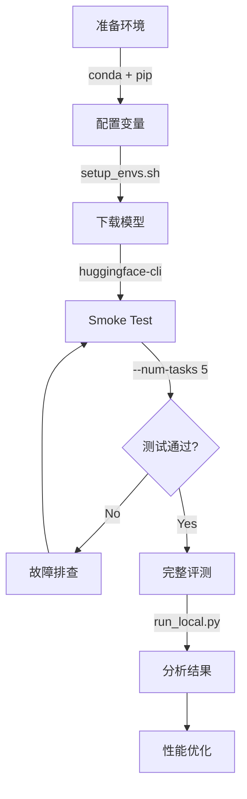

# τ²-Bench 本地运行指南

本指南说明如何在本地环境（非 SLURM 集群）运行 τ²-Bench 评测。

---

## 📋 目录

1. [前置要求](#前置要求)
2. [快速开始](#快速开始)
3. [命令行参数详解](#命令行参数详解)
4. [日志系统](#日志系统)
5. [输出说明](#输出说明)
6. [性能分析](#性能分析)
7. [故障排查](#故障排查)

---

## 📋 前置要求

### 1. 硬件要求

- **GPU**: 至少 1 个 NVIDIA GPU（推荐 4+ 个用于并行评测）
  - 每个 GPU 运行一个 vLLM server 实例
  - GPU 内存要求取决于模型大小（8B 模型约需 16-24GB）
- **CPU**: 多核 CPU（推荐 16+ 核心）
- **内存**: 至少 64GB RAM
- **存储**: 至少 100GB 可用空间（用于模型、数据和日志）

### 2. Conda 环境设置

#### 方案 A: vLLM 0.9.2（稳定版本）

```bash
conda create -n vllm1 python=3.12 -y
conda activate vllm1
pip install torch
pip install "transformers<4.54.0"
pip install vllm==0.9.2
cd evaluation/tau2-bench
pip install -e .
```

#### 方案 B: vLLM 0.10.1（Blackwell GPU 支持）

```bash
conda create -n vllm1 python=3.12 -y
conda activate vllm1

# 卸载旧版本
pip uninstall -y vllm torch transformers

# 安装 PyTorch 2.7.1 (CUDA 12.8)
pip install torch==2.7.1 torchvision==0.22.1 torchaudio==2.7.1 \
    --index-url https://download.pytorch.org/whl/cu128

# 安装 vLLM 0.10.1 和 transformers
pip install vllm==0.10.1 transformers

# vLLM 0.10.1+ 需要 hf_transfer 加速下载
pip install hf_transfer

# 安装 tau2-bench
cd evaluation/tau2-bench
pip install -e .
```

**注意**: transformers==4.57.3 + vLLM==0.10.1 已在 Blackwell GPU 上验证通过。

### 3. 环境变量配置

项目根目录提供了 `setup_envs.sh` 脚本，包含所有必需的环境变量。

#### 3.1 编辑 setup_envs.sh

```bash
cd /path/to/ToolOrchestra
vim setup_envs.sh  # 或使用其他编辑器
```

**必需的环境变量**：

```bash
# 模型和路径
export CKPT_DIR="/path/to/your/agent/model"          # Agent 模型路径
export REPO_PATH="/path/to/ToolOrchestra"            # 仓库根目录
export HF_HOME="/path/to/huggingface_cache"          # HuggingFace 缓存

# OpenAI API（必需，用于 user simulation）
export OPENAI_API_KEY="sk-..."                       # gpt-5 等模型
```

**可选的环境变量**：

```bash
# Anthropic API（如果使用 Claude）
export ANTHROPIC_API_KEY="sk-ant-..."

# Together API（如果使用 Together AI 服务）
export TOGETHER_API_KEY="..."

# Nebius API（Qwen3-32B 快速推理）
# 如果设置，Qwen3-32B 会自动使用 Nebius API 而不是本地 vLLM
export NEBIUS_API_KEY="v1...."

# Tavily Search API（Web 搜索功能）
export TAVILY_KEY="tvly-..."

# WandB（实验跟踪）
export WANDB_API_KEY="..."
```

#### 3.2 加载环境变量

```bash
cd /path/to/ToolOrchestra
source setup_envs.sh
```

脚本会自动验证环境并显示配置信息：

```
=========================================
ToolOrchestra Environment Configuration
=========================================
REPO_PATH:    /workspace/ToolOrchestra
CKPT_DIR:     /workspace/ckpt/nvidia/Nemotron-Orchestrator-8B
HF_HOME:      /home/user/.cache/huggingface

API Keys:
  OPENAI_API_KEY:    sk-proj-EP...
  ANTHROPIC_API_KEY: sk-ant-...
  TOGETHER_API_KEY:  tgp_v1_IM...
  NEBIUS_API_KEY:    v1.CmQKHH... (Qwen3-32B)
  TAVILY_KEY:        tvly-dev-r...
=========================================
✓ Conda environment: vllm1
=========================================
```

### 4. 模型下载

下载 agent 模型到 `$CKPT_DIR`：

```bash
# 方法 1: 从 HuggingFace 下载
huggingface-cli download nvidia/Nemotron-Orchestrator-8B \
    --local-dir $CKPT_DIR

# 方法 2: 使用 git-lfs
git lfs clone https://huggingface.co/nvidia/Nemotron-Orchestrator-8B $CKPT_DIR

# 验证模型文件
ls -lh $CKPT_DIR
# 应该看到: config.json, model.safetensors, tokenizer.json 等文件
```

---

## 🚀 快速开始

### 最简单的使用方式

确保已激活 conda 环境并加载环境变量后：

```bash
# 1. 激活环境
conda activate vllm1

# 2. 加载环境变量
cd /path/to/ToolOrchestra
source setup_envs.sh

# 3. 运行评测（使用默认参数）
cd evaluation/tau2-bench
python run_local.py --agent-model $CKPT_DIR
```

**默认行为**：
- ✅ 启动 **4 个 vLLM servers**（如果有足够 GPU）
- ✅ 评测 **retail, telecom, airline** 三个域（总共 278 个任务）
- ✅ 使用 **gpt-5** 作为 user simulator
- ✅ 结果保存在 **outputs/** 目录
- ✅ 显示实时**进度条**和 ETA
- ✅ 日志级别为 **INFO**
- ✅ **启用** expert routing（`--use_model_tool`，与官方 run.py 对齐）

**可用域**: `mock` (9 任务), `retail` (114 任务), `telecom` (114 任务), `airline` (50 任务)

**与官方 run.py 完全对齐**: 
- ✅ 评测的域和任务文件**完全相同**
- ✅ 默认启用 `--use_model_tool`（expert routing）
- ✅ Agent 可以调用 expert 模型（gpt-5, gpt-5-mini, Qwen3-32B）

**如果不需要 expert routing**（更快更便宜）:
```bash
python run_local.py --agent-model $CKPT_DIR --no-use-model-tool
```

### ### 推荐的完整命令

**标准评测（与官方 run.py 对齐）**:
```bash
python run_local.py \
  --agent-model $CKPT_DIR \
  --user-llm gpt-5 \
  --num-servers 4 \
  --domains retail telecom airline \
  --max-steps 200 \
  --num-trials 1 \
  --max-concurrency 10 \
  --log-level INFO \
  --output-dir outputs/run1 \
  --log-dir logs/run1
```

**说明**: 
- 评测 retail, telecom, airline 三个主要域，总共 278 个任务（retail: 114, telecom: 114, airline: 50）
- 默认**启用** expert routing（`--use_model_tool`），与官方 run.py 完全一致
- Agent 可以根据任务难度选择调用 expert 模型

**不带 expert routing 的简化版本**（更快更便宜）:
```bash
python run_local.py \
  --agent-model $CKPT_DIR \
  --user-llm gpt-5 \
  --num-servers 4 \
  --no-use-model-tool \
  --log-level INFO
```
这会禁用 expert routing，agent 只使用自己的能力。

### Smoke Test（快速验证）

运行少量任务验证环境配置：

**方法 1: 使用 mock 域（推荐）**
```bash
# Mock 域有少量简单任务，最适合快速验证
python run_local.py \
  --agent-model $CKPT_DIR \
  --domains mock \
  --num-servers 1 \
  --log-level INFO
```

**方法 2: 限制任务数量**
```bash
# 只评测 retail 域的前 10 个任务
python run_local.py \
  --agent-model $CKPT_DIR \
  --domains retail \
  --num-tasks 10 \
  --num-servers 1 \
  --log-level INFO
```

### Expert Routing（默认启用）

**默认情况下**，expert routing 已启用（与官方 run.py 对齐）：

```bash
# Expert routing 默认启用，查看详细的 expert 调用
python run_local.py \
  --agent-model $CKPT_DIR \
  --domains retail \
  --log-level PROFILE \
  2>&1 | tee eval_with_expert.log
```

**说明**: 
- `--use_model_tool` **默认已启用**（与官方 run.py 一致）
- Agent 可以选择调用以下 expert 模型:
  - **expert-1**: GPT-5（最强，$1.25/M input，平均 96s 延迟）
  - **expert-2**: GPT-5-mini（中等，$0.25/M input，平均 27s 延迟）
  - **expert-3**: Qwen3-32B（快速，$0.8/M input，平均 11s 延迟）
- Agent 会根据任务难度和成本权衡选择合适的 expert
- 使用 PROFILE 日志可以看到每次 expert 调用的详细信息：
  ```
  [PROFILE] ... type=expert_call model=gpt-5 call_type=openai duration_ms=2345.67
  ```

**禁用 expert routing**（更快更便宜，但偏离官方配置）:
```bash
python run_local.py \
  --agent-model $CKPT_DIR \
  --domains retail \
  --no-use-model-tool \
  --log-level INFO
```

这会禁用 call_expert，agent 只使用自己的能力，节省 API 成本。

---

## 📚 命令行参数详解

### 模型配置参数

#### `--agent-model PATH`
- **说明**: Agent 模型路径（必需）
- **默认**: `$CKPT_DIR` 环境变量
- **示例**: `--agent-model /data/models/Nemotron-Orchestrator-8B`

#### `--user-llm MODEL`
- **说明**: User simulator 使用的 LLM 模型
- **默认**: `gpt-5`
- **选项**: 
  - `gpt-5`: GPT-4 级别（推荐，与 baseline 一致）
  - `gpt-5-mini`: GPT-4 Mini（更快更便宜）
  - `claude-3-5-sonnet-20241022`: Claude Sonnet
  - `claude-4.1-opus`: Claude Opus（最强）
- **示例**: `--user-llm gpt-5`
- **注意**: 需要设置对应的 API key（`OPENAI_API_KEY` 或 `ANTHROPIC_API_KEY`）

### Server 配置参数

#### `--num-servers N`
- **说明**: 启动的 vLLM server 数量
- **默认**: `4`
- **推荐**: 等于可用 GPU 数量
- **示例**: 
  ```bash
  --num-servers 1   # 1 GPU，调试模式
  --num-servers 4   # 4 GPU，标准配置
  --num-servers 8   # 8 GPU，高吞吐量
  ```

#### `--start-port PORT`
- **说明**: Server 起始端口号
- **默认**: `1900`
- **说明**: 第 i 个 server 使用端口 `start-port + i`
- **示例**: `--start-port 2000`  # 使用端口 2000, 2001, 2002, ...

#### `--gpu-ids ID1 ID2 ...`
- **说明**: 指定使用的 GPU ID
- **默认**: 自动使用 0, 1, 2, ...
- **示例**: `--gpu-ids 0 2 4 6`  # 只使用偶数 GPU

#### `--stagger-delay SECONDS`
- **说明**: Server 启动间隔时间（秒）
- **默认**: `60`
- **说明**: 避免 GPU OOM，错开加载模型的时间
- **示例**: `--stagger-delay 30`  # GPU 内存充足时可减少

#### `--server-timeout SECONDS`
- **说明**: Server 启动超时时间（秒）
- **默认**: `600` (10 分钟)
- **示例**: `--server-timeout 1200`  # 大模型需要更长时间

#### `--skip-server-start`
- **说明**: 跳过启动 server，使用已运行的 server
- **默认**: 不跳过
- **使用场景**: 
  - 调试时避免重复启动
  - 手动管理 server
- **要求**: 需要手动创建 `model_config_local.json`

### 评测配置参数

#### `--domains DOMAIN1 DOMAIN2 ...`
- **说明**: 要评测的域
- **默认**: `retail telecom airline`（主要的三个生产域，278 任务）
- **可选值**: `mock`, `retail`, `telecom`, `airline`
- **域说明**:
  - `mock`: 测试域（9 个简单任务，用于验证环境）
  - `retail`: 零售客服（114 任务）
  - `telecom`: 电信客服（114 任务）
  - `airline`: 航空客服（50 任务）
- **示例**: 
  ```bash
  --domains mock               # 只评测 mock（9 任务，快速测试）
  --domains retail             # 只评测 retail（114 任务）
  --domains retail telecom     # 评测两个域（228 任务）
  --domains mock retail telecom airline  # 评测所有可用域（287 任务）
  ```
- **注意**: 其他域（bank, medicine, movie 等）虽然在 registry 中注册，但**暂无任务文件**，无法通过 run_local.py 评测

#### `--max-steps N`
- **说明**: 每个任务的最大步数
- **默认**: `200`
- **说明**: 达到最大步数会终止任务（termination_reason: MAX_STEPS）
- **示例**: `--max-steps 100`  # 快速测试

#### `--num-trials N`
- **说明**: 每个任务运行的次数
- **默认**: `1`
- **说明**: 用于评估 agent 稳定性（多次运行取平均）
- **示例**: `--num-trials 3`  # 每个任务运行 3 次

#### `--num-tasks N`
- **说明**: 只运行前 N 个任务（smoke test）
- **默认**: `None`（运行所有任务）
- **示例**: 
  ```bash
  --num-tasks 10   # 只运行前 10 个任务
  --num-tasks 50   # 快速验证
  ```

#### `--max-concurrency N`
- **说明**: 最大并发任务数
- **默认**: `10`
- **说明**: 
  - 太高: 可能导致 GPU OOM 或 server 负载过高
  - 太低: 降低评测速度
- **推荐**: `num-servers * 2` 到 `num-servers * 3`
- **示例**: 
  ```bash
  --max-concurrency 1    # 调试模式（串行执行）
  --max-concurrency 10   # 标准配置
  --max-concurrency 20   # 8 个 server 时的高并发
  ```

#### `--use_model_tool` / `--no-use-model-tool`
- **说明**: 启用/禁用 expert routing（call_expert 功能）
- **默认**: **启用**（与官方 run.py 对齐）
- **说明**: Agent 可以调用更强的 expert 模型（gpt-5, gpt-5-mini, Qwen3-32B）
- **示例**: 
  ```bash
  --use_model_tool           # 启用（默认）
  --no-use-model-tool        # 禁用（更快更便宜）
  ```
- **Expert 模型选项**:
  - expert-1: GPT-5（$1.25/M input, ~96s 延迟）
  - expert-2: GPT-5-mini（$0.25/M input, ~27s 延迟）
  - expert-3: Qwen3-32B（$0.8/M input, ~11s 延迟）
- **注意**: 启用会增加 API 调用成本和延迟，但可能提高任务成功率

#### `--max-errors N`
- **说明**: 允许的连续 tool error 次数
- **默认**: `10`
- **说明**: 达到上限会终止任务（termination_reason: TOO_MANY_ERRORS）
- **示例**: `--max-errors 5`

#### `--seed N`
- **说明**: 随机种子（reproducibility）
- **默认**: `300`
- **说明**: 与 tau2-bench baseline 一致
- **示例**: `--seed 42`

### 日志配置参数

#### `--log-level LEVEL`
- **说明**: 日志级别
- **默认**: `INFO`
- **可选值**: `DEBUG`, `PROFILE`, `INFO`, `WARNING`, `ERROR`, `CRITICAL`
- **详细说明**:
  - **`DEBUG`**: 显示所有细节（agent/环境初始化、每个 step）
  - **`PROFILE`**: 记录性能数据（LLM calls, tool calls, step timing）精确到毫秒
  - **`INFO`**: 显示进度条和基本信息（推荐用于正常评测）
  - **`WARNING`**: 只显示警告和更严重的信息
  - **`ERROR`**: 只显示错误
- **示例**: 
  ```bash
  --log-level INFO       # 正常评测
  --log-level PROFILE    # 性能分析
  --log-level DEBUG      # 调试问题
  ```

#### `--log-dir DIR`
- **说明**: vLLM server 日志目录
- **默认**: `logs`
- **示例**: `--log-dir logs/run1`

### 输出配置参数

#### `--output-dir DIR`
- **说明**: 评测结果保存目录
- **默认**: `outputs`
- **说明**: 每个域的结果保存为 `{domain}.json`
- **示例**: `--output-dir outputs/experiment1`

#### `--model-config-path FILE`
- **说明**: 模型配置文件路径
- **默认**: `model_config_local.json`
- **说明**: 自动生成，包含所有 server 的 IP 和端口信息
- **示例**: `--model-config-path configs/my_config.json`

---

## 🔧 高级用法

### 使用已运行的 vLLM Server

如果已经手动启动了 vLLM server，可以跳过启动步骤：

#### 步骤 1: 手动启动 vLLM Servers

```bash
# Terminal 1: 启动第一个 server
CUDA_VISIBLE_DEVICES=0 vllm serve $CKPT_DIR \
  --enable-auto-tool-choice \
  --tool-call-parser hermes \
  --port 1900

# Terminal 2: 启动第二个 server
CUDA_VISIBLE_DEVICES=1 vllm serve $CKPT_DIR \
  --enable-auto-tool-choice \
  --tool-call-parser hermes \
  --port 1901
```

#### 步骤 2: 创建配置文件

```bash
cat > model_config_local.json << EOF
{
  "$CKPT_DIR": [
    {"ip_addr": "127.0.0.1", "port": "1900"},
    {"ip_addr": "127.0.0.1", "port": "1901"}
  ],
  "vllm_model_config_path": "model_config_local.json"
}
EOF
```

#### 步骤 3: 运行评测

```bash
python run_local.py \
  --agent-model $CKPT_DIR \
  --skip-server-start \
  --model-config-path model_config_local.json
```

### 多次运行同一域

评估 agent 的稳定性（variance）：

```bash
python run_local.py \
  --agent-model $CKPT_DIR \
  --domains retail \
  --num-trials 5 \
  --seed 42
```

每个任务会运行 5 次，使用不同的随机种子。

### 分域运行并合并结果

大规模评测时，可以分域运行以便中断恢复：

```bash
# 运行 retail
python run_local.py --agent-model $CKPT_DIR --domains retail \
  --output-dir outputs/batch1

# 运行 telecom
python run_local.py --agent-model $CKPT_DIR --domains telecom \
  --output-dir outputs/batch1

# 运行 airline
python run_local.py --agent-model $CKPT_DIR --domains airline \
  --output-dir outputs/batch1

# 结果会保存在 outputs/batch1/ 下
```

### 完整示例命令

#### 基础评测（正常运行）

```bash
python run_local.py \
  --agent-model $CKPT_DIR \
  --user-llm gpt-5 \
  --num-servers 4 \
  --domains retail telecom airline \
  --max-steps 200 \
  --num-trials 1 \
  --max-concurrency 10 \
  --log-level INFO \
  --output-dir outputs/baseline_run \
  --log-dir logs/baseline_run
```

#### 性能分析评测（PROFILE 日志）

```bash
python run_local.py \
  --agent-model $CKPT_DIR \
  --user-llm gpt-5 \
  --num-servers 4 \
  --domains retail \
  --max-steps 200 \
  --num-trials 1 \
  --max-concurrency 10 \
  --log-level PROFILE \
  --output-dir outputs/profile_run \
  --log-dir logs/profile_run \
  2>&1 | tee evaluation_profile.log

# 提取 PROFILE 数据用于分析
grep "\[PROFILE\]" evaluation_profile.log > profile_data.log
grep "\[USER_JUDGE\]" evaluation_profile.log > judge_data.log
```

#### 查看 Expert Routing 详情

```bash
# Expert routing 默认启用，使用 PROFILE 查看详细调用信息
python run_local.py \
  --agent-model $CKPT_DIR \
  --user-llm gpt-5 \
  --num-servers 4 \
  --domains retail \
  --log-level PROFILE \
  --output-dir outputs/with_expert \
  2>&1 | tee expert_eval.log

# 分析 expert 调用情况
grep "type=expert_call" expert_eval.log | wc -l
grep "type=expert_call" expert_eval.log | head -10
```

#### 快速 Smoke Test

```bash
# 方法 1: 使用 mock 域（9 个任务，禁用 expert 加快速度）
python run_local.py \
  --agent-model $CKPT_DIR \
  --domains mock \
  --num-servers 1 \
  --max-concurrency 1 \
  --no-use-model-tool \
  --log-level DEBUG

# 方法 2: retail 前 10 个任务（带 expert）
python run_local.py \
  --agent-model $CKPT_DIR \
  --domains retail \
  --num-tasks 10 \
  --num-servers 1 \
  --max-concurrency 1 \
  --log-level DEBUG
```

#### 高并发大规模评测

```bash
# 8 GPU，高并发，评测所有域（带 expert，默认）
python run_local.py \
  --agent-model $CKPT_DIR \
  --user-llm gpt-5 \
  --num-servers 8 \
  --domains retail telecom airline \
  --max-concurrency 24 \
  --stagger-delay 30 \
  --log-level INFO \
  --output-dir outputs/full_eval \
  --log-dir logs/full_eval

# 不带 expert（更快，适合快速迭代）
python run_local.py \
  --agent-model $CKPT_DIR \
  --user-llm gpt-5 \
  --num-servers 8 \
  --domains retail telecom airline \
  --max-concurrency 24 \
  --no-use-model-tool \
  --log-level INFO \
  --output-dir outputs/fast_eval \
  --log-dir logs/fast_eval
```

---

## 📊 日志系统

> **高级用户**: 有关日志架构、Profile 数据格式和调试工作流的详细技术说明，请参阅专门的文档 [LOGGING_AND_DEBUGGING.md](./LOGGING_AND_DEBUGGING.md)。

### 日志级别层次

```
DEBUG (10)      ← 最详细
PROFILE (15)    ← 性能分析
USER_JUDGE (15) ← 评测框架
INFO (20)       ← 默认
WARNING (30)
ERROR (40)
CRITICAL (50)   ← 最严重
```

### 各级别说明

#### DEBUG Level
**用途**: 调试 agent 行为和环境问题

**输出内容**:
- Agent/Environment 初始化详情
- 每个 step 的详细信息（from_role → to_role）
- Message 传递过程
- 工具同步（sync_tools）

**使用场景**: 
- Agent 行为异常
- Task 失败需要定位原因
- 开发新功能

#### PROFILE Level
**用途**: 性能分析和优化

**输出内容**:
- **LLM calls**: Agent 主模型调用
  - `type=llm_call`
  - `model`, `call_type` (vllm/openai/claude)
  - `duration_ms`: 精确到毫秒
  - `has_tool_calls`: 是否有 tool 调用
- **Expert calls**: Expert 模型调用（如果启用 `--use_model_tool`）
  - `type=expert_call`
  - `model` (gpt-5/gpt-5-mini/Qwen3-32B)
  - `duration_ms`
- **Tool calls**: 本地 Python 函数执行
  - `type=tool_call`
  - `function`: 函数名
  - `call_type=local_function`
  - `duration_ms`
  - `error`: 是否有错误
- **Step completion**: 完整 step 执行时间
  - `type=step_complete`
  - `total_duration_ms`: LLM + tool 总时间
  - `from_role`, `to_role`

**使用场景**:
- 分析性能瓶颈
- 比较不同模型的延迟
- 优化 tool call 效率
- 计算 cost 和 latency 统计

#### USER_JUDGE Level
**用途**: 记录评测框架的 LLM 调用

**输出内容**:
- **User simulator**: `type=user_sim`
- **LLM-as-judge**: `type=evaluator`
- 包含 `model`, `call_type`, `duration_ms`

**使用场景**:
- 分析评测成本
- User simulator 性能分析
- Judge model 调用统计

#### INFO Level（默认）
**用途**: 正常评测

**输出内容**:
- 实时进度条
- 任务完成信息
- 评测开始/结束

**使用场景**: 大部分正常评测

## 📊 输出说明

### 1. 实时进度条

运行时会显示实时进度条（使用 `rich` 库）：
```
  ⠋ Eval retail (114 tasks) ━━━━━━━━━━━━━━━━━━━━━━━ 42/114 37% [00:15:23 / 00:25:42]
```

**进度条元素**:
- **Spinner** (⠋): 表示正在运行
- **Domain**: 当前评测的域
- **Task count**: (已完成/总任务数)
- **Progress bar**: 可视化进度
- **Percentage**: 完成百分比
- **Time elapsed**: 已用时间（实际已花费）
- **Time remaining**: 预计剩余时间（ETA，基于当前速度估算）

**更新频率**: 每 10 秒自动更新，或任务完成时立即更新

### 2. Console 日志输出

#### INFO Level 输出示例

```
[2025-12-23 10:15:00] Starting 4 vLLM server(s)...
[2025-12-23 10:15:01] Starting vLLM server: /workspace/ckpt/Orchestrator-8B
[2025-12-23 10:15:01]   GPU: 0, Port: 1900
[2025-12-23 10:16:30] ✓ Server on port 1900 is ready (took 89s)
[2025-12-23 10:16:30] Model configuration written to model_config_local.json
[INFO] 2025-12-23 10:16:31.123 task=global thread=140235 Starting evaluation: 278 tasks with max_concurrency=10
  ⠋ Eval retail (114 tasks) ━━━━━━━━━━━━━━━━━━━━━━━━━━━━━━━ 114/114 100% [01:23:45 / 00:00:00]
  ⠋ Eval telecom (114 tasks) ━━━━━━━━━━━━━━━━━━━━━━━━━━━━━━ 114/114 100% [01:28:12 / 00:00:00]
  ⠋ Eval airline (50 tasks) ━━━━━━━━━━━━━━━━━━━━━━━━━━━━━━━━ 50/50 100% [00:35:30 / 00:00:00]
[INFO] 2025-12-23 13:44:28 task=global thread=140235 Completed 278 simulations
[2025-12-23 13:44:30] ========== EVALUATION SUMMARY ==========
[2025-12-23 13:44:30] RETAIL: SUCCESS
[2025-12-23 13:44:30] TELECOM: SUCCESS
[2025-12-23 13:44:30] AIRLINE: SUCCESS
[2025-12-23 13:44:30] ========================================
```

#### PROFILE Level 输出示例

使用 `--log-level PROFILE` 时，会看到详细的性能计时信息：

```
[PROFILE] 2025-12-23 10:15:32.456 task=retail_001 thread=12345 type=llm_call model=nemotron call_type=vllm step=5 duration_ms=1234.56 has_tool_calls=True
[PROFILE] 2025-12-23 10:15:32.789 task=retail_001 thread=12345 type=expert_call model=gpt-5 call_type=openai duration_ms=2345.67
[PROFILE] 2025-12-23 10:15:33.012 task=retail_001 thread=12345 type=tool_call function=get_order_details call_type=local_function step=5 duration_ms=12.34
[PROFILE] 2025-12-23 10:15:33.015 task=retail_001 thread=12345 type=step_complete step=5 total_duration_ms=3591.00 from_role=agent to_role=env
[USER_JUDGE] 2025-12-23 10:15:34.100 task=retail_001 thread=12345 type=user_sim model=gpt-5 call_type=openai duration_ms=890.12
[USER_JUDGE] 2025-12-23 10:15:40.500 task=retail_001 thread=12345 type=evaluator model=gpt-5 call_type=openai duration_ms=1200.34
```

**日志字段说明**:
- `task`: 当前任务 ID
- `thread`: 线程 ID（支持多线程并发执行）
- `type`: 事件类型
  - `llm_call`: Agent 主模型调用
  - `expert_call`: Expert 模型调用（通过 call_expert）
  - `tool_call`: 本地 Python 函数调用
  - `step_complete`: 完整 step 执行完成
  - `user_sim`: User simulator 调用
  - `evaluator`: LLM-as-judge 评估器调用
- `model`: 使用的模型名称
- `call_type`: 调用类型（`vllm`/`openai`/`claude`/`local_function`）
- `duration_ms`: Wall clock 运行时间（毫秒）
- `step`: 当前 step 编号

#### 使用 PROFILE 日志进行性能分析

PROFILE 日志可以用于：
1. **分析 tool call 时间分布**: 筛选 `type=tool_call` 的行
2. **分析不同 LLM 调用的延迟**: 筛选 `type=llm_call` 和 `type=expert_call`
3. **计算统计信息**: 使用脚本提取 `duration_ms` 计算 mean/variance

示例分析脚本：
```bash
# 提取所有 PROFILE 日志
grep "\[PROFILE\]" output.log > profile.log

# 统计各类 tool call 的平均时间
grep "type=tool_call" profile.log | \
  awk '{for(i=1;i<=NF;i++){if($i~/duration_ms=/){print $i}}}' | \
  cut -d'=' -f2 | \
  awk '{sum+=$1; count++} END {print "Mean:", sum/count, "ms"}'

# 统计 LLM call 的总时间
grep "type=llm_call" profile.log | \
  awk '{for(i=1;i<=NF;i++){if($i~/duration_ms=/){print $i}}}' | \
  cut -d'=' -f2 | \
  awk '{sum+=$1} END {print "Total:", sum, "ms"}'
```

### 文件输出结构

```
evaluation/tau2-bench/
├── outputs/                          # 评测结果
│   └── retail.json                   # Retail 域完整结果
├── logs/                              # vLLM server 日志
│   ├── vllm_port_1900_*.out          # Server stdout
│   └── vllm_port_1900_*.err          # Server stderr
├── model_config_local.json            # 模型配置（自动生成）
└── evaluation.log                     # 评测日志（如果使用 tee）
```

#### outputs/{domain}.json 结构

```json
{
  "info": {
    "agent_info": {"implementation": "llm_agent", "llm": "..."},
    "user_info": {"implementation": "user_simulator", "llm": "gpt-5"},
    "max_steps": 200,
    "num_trials": 1
  },
  "tasks": [...],  // Task definitions
  "simulations": [  // Simulation results
    {
      "id": "uuid",
      "task_id": "retail_001",
      "duration": 75.23,
      "termination_reason": "agent_stop",
      "reward_info": {"reward": 1.0},
      "messages": [...]
    }
  ]
}
```

---

## 🔧 故障排查

### 常见问题

#### 问题 1: GPU 内存不足

**错误信息**:
```
CUDA out of memory
torch.cuda.OutOfMemoryError
```

**原因**: GPU 内存不足以加载模型或处理并发请求

**解决方案**:
1. 减少 server 数量:
   ```bash
   --num-servers 1
   ```

2. 降低并发数:
   ```bash
   --max-concurrency 1
   ```

3. 检查 GPU 内存使用:
   ```bash
   nvidia-smi
   ```

4. 清理 GPU 内存:
   ```bash
   # 停止所有 vLLM 进程
   pkill -9 -f vllm
   ```

#### 问题 2: vLLM Server 启动超时

**错误信息**:
```
✗ Server on port 1900 failed to start within 600s
```

**原因**: 模型加载时间过长或 server 启动失败

**解决方案**:
1. 增加超时时间:
   ```bash
   --server-timeout 1200  # 20 分钟
   ```

2. 检查 server 日志:
   ```bash
   tail -100 logs/vllm_port_1900_*.out
   cat logs/vllm_port_1900_*.err
   ```

3. 验证模型路径:
   ```bash
   ls -lh $CKPT_DIR
   # 应该看到: config.json, model.safetensors, tokenizer.json
   ```

4. 手动测试 server 启动:
   ```bash
   CUDA_VISIBLE_DEVICES=0 vllm serve $CKPT_DIR \
     --enable-auto-tool-choice \
     --tool-call-parser hermes \
     --port 1900
   ```

#### 问题 3: 环境变量未设置

**错误信息**:
```
ERROR: Agent model path not specified
ERROR: Task file not found
```

**解决方案**:
```bash
# 检查环境变量
echo $CKPT_DIR
echo $REPO_PATH
echo $OPENAI_API_KEY

# 加载环境变量
cd /path/to/ToolOrchestra
source setup_envs.sh
```

#### 问题 4: API Key 错误

**错误信息**:
```
API key not found
Authentication failed
Incorrect API key provided
```

**解决方案**:
1. 检查 API key:
   ```bash
   echo $OPENAI_API_KEY | cut -c1-10
   ```

2. 验证 API key:
   ```bash
   # 测试 OpenAI API
   curl https://api.openai.com/v1/models \
     -H "Authorization: Bearer $OPENAI_API_KEY"
   ```

3. 更新 API key:
   ```bash
   export OPENAI_API_KEY="sk-proj-..."
   ```

#### 问题 5: 端口已被占用

**错误信息**:
```
Address already in use
OSError: [Errno 48] Address already in use
```

**解决方案**:
1. 检查端口占用:
   ```bash
   lsof -i:1900
   netstat -tuln | grep 1900
   ```

2. 停止占用端口的进程:
   ```bash
   lsof -ti:1900 | xargs kill -9
   ```

3. 使用不同端口:
   ```bash
   --start-port 2000
   ```

#### 问题 6: Task 失败或 Reward = 0

**现象**: 所有或大部分 task 的 reward 都是 0

**可能原因**:
- Agent 没有正确调用 tools
- User simulator 质量问题
- 评测标准不匹配

**调试步骤**:
1. 使用 DEBUG 级别查看详细执行过程:
   ```bash
   --log-level DEBUG --num-tasks 1
   ```

2. 检查一个失败 task 的 messages:
   ```python
   import json
   with open('outputs/retail.json') as f:
       data = json.load(f)
   # 查看第一个 simulation 的 messages
   print(data['simulations'][0]['messages'])
   ```

3. 验证 agent 是否正确加载工具定义

#### 问题 7: 进度条卡住不动

**现象**: 进度条长时间不更新

**可能原因**:
- Task 执行时间过长
- LLM API 响应慢
- 并发数设置过高导致排队

**解决方案**:
1. 检查是否有活跃的进程:
   ```bash
   ps aux | grep python
   ps aux | grep vllm
   ```

2. 查看最近的日志输出:
   ```bash
   tail -20 logs/vllm_port_1900_*.out
   ```

3. 降低并发数:
   ```bash
   --max-concurrency 5
   ```

#### 问题 8: transformers 版本冲突

**错误信息**:
```
ImportError: cannot import name 'PreTrainedTokenizer' from 'transformers'
AttributeError: module 'transformers' has no attribute '...'
```

**解决方案**:
```bash
# 重新安装兼容版本
pip uninstall -y transformers vllm
pip install vllm==0.9.2 "transformers<4.54.0"
```

### 调试技巧

#### 1. 使用 Smoke Test 快速验证

```bash
# 方法 1: 使用 mock 域（推荐，只有 9 个任务）
python run_local.py \
  --agent-model $CKPT_DIR \
  --domains mock \
  --num-servers 1 \
  --max-concurrency 1 \
  --log-level DEBUG

# 方法 2: 使用 retail 的第 1 个任务
python run_local.py \
  --agent-model $CKPT_DIR \
  --domains retail \
  --num-tasks 1 \
  --num-servers 1 \
  --max-concurrency 1 \
  --log-level DEBUG
```

#### 2. 查看详细的 LLM 调用

```bash
# 设置环境变量启用 trace
export TAU2_TRACE=1

# 运行评测
python run_local.py --agent-model $CKPT_DIR --log-level DEBUG
```

#### 3. 分析 vLLM Server 性能

```bash
# 查看 GPU 利用率
watch -n 1 nvidia-smi

# 查看 vLLM 请求统计
curl http://localhost:1900/metrics
```

#### 4. 检查网络连接

```bash
# 测试 server 是否可访问
curl http://localhost:1900/health

# 查看当前连接
netstat -an | grep 1900
```

---

## 📝 与官方 run.py 的对比

| 特性 | run.py (SLURM) | run_local.py (本地) |
|------|----------------|---------------------|
| **调度系统** | SLURM 集群 | 直接启动进程 |
| **服务器 IP** | 集群节点 IP（动态） | 127.0.0.1 (localhost) |
| **GPU 分配** | SLURM 自动分配（8 GPU） | 手动指定 `--gpu-ids` |
| **评测域** | retail, telecom, airline | **完全相同** ✅ |
| **任务文件** | tasks.json（相同文件） | **完全相同** ✅ |
| **Expert Routing** | 启用 (`--use_model_tool`) | **默认启用** ✅ |
| **User LLM** | gpt-5 | gpt-5（默认） ✅ |
| **Max Steps** | 200 | 200（默认） ✅ |
| **Judge Model** | 启动本地 Qwen3-32B servers | 通过 API 调用 gpt-5 |
| **日志输出** | SLURM 作业输出文件 | stdout + 本地 logs/ |
| **进度显示** | 无 | rich 进度条 + ETA ✨ |
| **日志系统** | 简单 print | 结构化 logging（PROFILE/DEBUG）✨ |
| **循环运行** | 是（持续监控任务队列） | 否（运行一次后退出） |

**✅ 完全对齐**: 默认参数下，`run_local.py` 与官方 `run.py` 的评测配置**完全一致**:

```bash
# 默认配置即与 run.py 对齐
python run_local.py --agent-model $CKPT_DIR
```

**如果不需要 expert routing**（更快更便宜，但偏离官方配置）:
```bash
python run_local.py --agent-model $CKPT_DIR --no-use-model-tool
```

**不启用 expert 的影响**:
- Agent 只能使用自己的能力，不能调用 expert 模型
- 性能可能略低于官方 run.py 的结果
- 但评测速度更快（无 expert API 调用），成本更低（无 OpenAI API 费用）

## 💡 性能优化建议

1. **并行服务器**: 如果有多个 GPU，启动多个服务器可以加快评测速度
   ```bash
   --num-servers 4  # 4 个 GPU，每个运行一个服务器
   ```

2. **减少启动延迟**: 如果 GPU 内存充足，可以减少启动间隔
   ```bash
   --stagger-delay 30  # 从默认的 60 秒减少到 30 秒
   ```

3. **分批评测**: 如果时间有限，可以先评测单个域
   ```bash
   --domains retail  # 只评测 retail，之后再评测其他域
   ```

4. **调整并发**: 通过启动多个服务器实例来提高吞吐量
   - 1 个 GPU: `--num-servers 1`
   - 4 个 GPU: `--num-servers 4`
   - 8 个 GPU: `--num-servers 8`

5. **使用合适的日志级别**: 
   - 正常评测: `--log-level INFO`（显示进度条，性能最佳）
   - 性能分析: `--log-level PROFILE`（记录详细计时，略微影响性能）
   - 调试问题: `--log-level DEBUG`（显示所有细节，会产生大量输出）

## 🔬 性能分析工作流

### 1. 收集 PROFILE 数据

```bash
# 运行评测并保存日志
python run_local.py \
  --agent-model $CKPT_DIR \
  --domains retail \
  --log-level PROFILE \
  2>&1 | tee full_eval.log

# 提取 PROFILE 日志
grep "\[PROFILE\]" full_eval.log > profile_data.log
grep "\[USER_JUDGE\]" full_eval.log > judge_data.log
```

### 2. 分析不同类型的调用

```bash
# 统计各类型 tool call 的数量和时间
for type in llm_call expert_call tool_call step_complete; do
  echo "=== $type ==="
  grep "type=$type" profile_data.log | wc -l
  grep "type=$type" profile_data.log | \
    grep -oP 'duration_ms=\K[0-9.]+' | \
    awk '{sum+=$1; sumsq+=$1*$1; count++} 
         END {mean=sum/count; 
              print "Count:", count, 
                    "Mean:", mean, "ms", 
                    "StdDev:", sqrt(sumsq/count - mean*mean), "ms"}'
done
```

### 3. 分析不同模型的性能

```bash
# 分析不同模型的调用时间
for model in vllm openai claude; do
  echo "=== call_type=$model ==="
  grep "call_type=$model" profile_data.log | \
    grep -oP 'duration_ms=\K[0-9.]+' | \
    awk '{sum+=$1; count++} END {print "Total:", sum, "ms, Avg:", sum/count, "ms"}'
done
```

### 4. 按任务分析

```bash
# 找出最慢的任务
grep "type=step_complete" profile_data.log | \
  awk '{
    for(i=1;i<=NF;i++) {
      if($i~/task=/) task=$i;
      if($i~/duration_ms=/) {
        split($i,a,"="); 
        duration=a[2];
      }
    }
    sum[task]+=duration; count[task]++;
  } 
  END {
    for(t in sum) 
      print t, "Total:", sum[t], "ms, Avg:", sum[t]/count[t], "ms"
  }' | sort -k3 -nr | head -10
```

---

## 🎯 快速开始检查清单

在运行评测前，确保以下所有项目已完成：

### 环境准备

- [ ] **Conda 环境**
  ```bash
  conda activate vllm1
  python --version  # 应该是 Python 3.12
  ```

- [ ] **依赖安装**
  ```bash
  cd /path/to/ToolOrchestra/evaluation/tau2-bench
  pip install -e .
  pip list | grep vllm  # 验证 vLLM 已安装
  ```

- [ ] **环境变量**
  ```bash
  source setup_envs.sh
  # 验证关键变量
  echo $CKPT_DIR
  echo $REPO_PATH
  echo $OPENAI_API_KEY | cut -c1-10
  ```

### 资源验证

- [ ] **Agent 模型**
  ```bash
  ls -lh $CKPT_DIR
  # 应该看到: config.json, model.safetensors, tokenizer.json 等
  ```

- [ ] **GPU 可用性**
  ```bash
  nvidia-smi
  # 至少 1 个 GPU，有足够的可用内存（16GB+）
  ```

- [ ] **任务数据文件**
  ```bash
  ls -lh $REPO_PATH/data/tau2/domains/*/tasks.json
  # 应该看到 retail, telecom, airline 等域的任务文件
  ```

### 运行测试

- [ ] **Smoke Test（必需）**
  ```bash
  # 推荐：使用 mock 域
  python run_local.py \
    --agent-model $CKPT_DIR \
    --domains mock \
    --num-servers 1 \
    --log-level INFO
  
  # 或者：retail 前 5 个任务
  python run_local.py \
    --agent-model $CKPT_DIR \
    --domains retail \
    --num-tasks 5 \
    --num-servers 1 \
    --log-level INFO
  ```

- [ ] **验证输出**
  ```bash
  # 检查结果文件
  cat outputs/retail.json | python -m json.tool | head -20
  
  # 检查 server 日志
  ls -lh logs/
  ```

### 开始完整评测

如果 smoke test 成功：

```bash
python run_local.py \
  --agent-model $CKPT_DIR \
  --user-llm gpt-5 \
  --num-servers 4 \
  --domains retail telecom airline \
  --log-level INFO \
  --output-dir outputs/full_eval
```

---

## 🌐 支持的域（Domains）

### 当前可评测的域（有任务文件）

**run_local.py** 目前支持以下 4 个域：

| 域名 | 说明 | 任务文件 | 任务数 |
|------|------|----------|--------|
| **mock** | 测试域（简单任务） | `mock/tasks.json` | 9 |
| **retail** | 零售客服（订单、退货、产品查询） | `retail/tasks.json` | 114 |
| **telecom** | 电信客服（套餐、账单、技术支持） | `telecom/tasks.json` | 114 |
| **airline** | 航空客服（订票、改签、行李） | `airline/original_tasks.json` | 50 |

**默认评测**: `retail`, `telecom`, `airline`（278 任务，不包括 mock）  
**全部评测**: `mock`, `retail`, `telecom`, `airline`（287 任务）

**使用方法**:
```bash
# 评测默认的三个域
python run_local.py --agent-model $CKPT_DIR

# 评测单个域
python run_local.py --agent-model $CKPT_DIR --domains retail

# 评测多个域
python run_local.py --agent-model $CKPT_DIR --domains retail telecom

# 包含 mock 测试域
python run_local.py --agent-model $CKPT_DIR --domains mock retail

# 评测所有可用域
python run_local.py --agent-model $CKPT_DIR --domains mock retail telecom airline
```

### 其他已注册的域（暂无任务文件）

以下域已在 registry 中注册，但**当前没有任务文件**，无法直接通过 `run_local.py` 评测：

- **bank**: 银行服务
- **basketball**: 篮球赛事
- **ecommerce**: 电商平台
- **medicine**: 医疗咨询
- **movie**: 电影票务
- **railway**: 铁路票务
- **restaurant**: 餐厅预订
- **school**: 学校行政
- **travel**: 旅行预订
- **weather**: 天气查询

**说明**: 这些域有环境定义（policy, database, tools），但缺少评测任务。如果你需要评测这些域，需要：
1. 创建任务文件 `data/tau2/domains/{domain}/tasks.json`
2. 更新 `run_local.py` 的 `task_paths` 字典

### Telecom 域的变体

Telecom 域有多个任务文件：
- `tasks.json`: 标准任务集（默认使用，114 任务）
- `tasks_small.json`: 小规模任务集（20 任务，用于快速测试）
- `tasks_full.json`: 完整任务集（格式有问题，暂不可用）

**使用 tasks_small.json**:
```bash
# 方法 1: 临时修改 run_local.py 的 task_paths（不推荐）

# 方法 2: 直接使用 tau2.cli（推荐）
python -m tau2.cli --domain telecom \
  --agent-llm $CKPT_DIR \
  --user-llm gpt-5 \
  --task_path $REPO_PATH/data/tau2/domains/telecom/tasks_small.json \
  --output_file outputs/telecom_small.json \
  --model_config_path model_config_local.json \
  --max-concurrency 10 \
  --log-level INFO

# 注意：需要先启动 vLLM servers 并创建 model_config_local.json
```

### 查看任务文件内容

查看各域有多少任务：

```bash
# 查看任务数量
for domain in mock retail telecom airline; do
  file="$REPO_PATH/data/tau2/domains/$domain/tasks.json"
  if [ "$domain" = "airline" ]; then
    file="$REPO_PATH/data/tau2/domains/airline/original_tasks.json"
  fi
  count=$(python -c "import json; print(len(json.load(open('$file'))))")
  echo "$domain: $count tasks"
done

# 查看单个任务的结构
python -c "
import json
with open('$REPO_PATH/data/tau2/domains/retail/tasks.json') as f:
    tasks = json.load(f)
    print(json.dumps(tasks[0], indent=2))
" | head -50
```

---

## 📞 获取帮助

### 命令行帮助

查看所有可用选项和说明：
```bash
python run_local.py --help
```

### 诊断脚本

快速诊断环境配置：
```bash
# 检查环境
echo "=== Environment ==="
echo "CKPT_DIR: $CKPT_DIR"
echo "REPO_PATH: $REPO_PATH"
echo "Python: $(python --version)"
echo "Conda env: $CONDA_DEFAULT_ENV"

# 检查 GPU
echo -e "\n=== GPUs ==="
nvidia-smi --query-gpu=index,name,memory.total,memory.free --format=csv

# 检查依赖
echo -e "\n=== Dependencies ==="
pip list | grep -E "vllm|torch|transformers|rich"

# 检查端口
echo -e "\n=== Ports ==="
netstat -tuln | grep -E "1900|1901|1902|1903"
```

### 日志分析

```bash
# 查看最近的错误
grep -i error logs/*.err | tail -20

# 查看 vLLM 启动日志
tail -100 logs/vllm_port_1900_*.out

# 统计任务成功率
python -c "
import json
with open('outputs/retail.json') as f:
    data = json.load(f)
total = len(data['simulations'])
success = sum(1 for s in data['simulations'] if s['reward_info']['reward'] > 0)
print(f'Success rate: {success}/{total} ({100*success/total:.1f}%)')
"
```

### 社区资源

- **GitHub Issues**: [nvidia/ToolOrchestra/issues](https://github.com/nvidia/ToolOrchestra/issues)
- **文档**: `evaluation/tau2-bench/README.md`
- **原版 tau2-bench**: [sierra-research/tau-bench](https://github.com/sierra-research/tau-bench)

---

## 📝 总结

### 基本工作流程



### 关键命令速查

| 目的 | 命令 |
|------|------|
| 快速测试 | `python run_local.py --agent-model $CKPT_DIR --domains mock --no-use-model-tool` |
| 标准评测（带 expert） | `python run_local.py --agent-model $CKPT_DIR --log-level INFO` |
| 单域评测（带 expert） | `python run_local.py --agent-model $CKPT_DIR --domains retail` |
| 性能分析（查看 expert） | `python run_local.py --agent-model $CKPT_DIR --domains retail --log-level PROFILE 2>&1 \| tee eval.log` |
| 不带 expert（快速） | `python run_local.py --agent-model $CKPT_DIR --domains retail --no-use-model-tool` |
| 调试模式 | `python run_local.py --agent-model $CKPT_DIR --domains mock --log-level DEBUG --no-use-model-tool` |
| 查看帮助 | `python run_local.py --help` |

### 最佳实践

1. **渐进式测试**: Smoke test → 单域 → 多域
2. **合理配置**: 根据 GPU 数量调整 `--num-servers` 和 `--max-concurrency`
3. **日志管理**: 使用 `tee` 保存日志，便于后续分析
4. **性能监控**: 运行时用 `watch nvidia-smi` 监控 GPU 使用
5. **备份结果**: 定期备份 `outputs/` 目录
6. **增量评测**: 大规模评测时分域运行，避免一次性失败

### 常用参数组合

```bash
# 开发调试（mock 域，禁用 expert）
--domains mock --num-servers 1 --max-concurrency 1 --log-level DEBUG --no-use-model-tool

# 快速验证（单域前 50 个任务，带 expert）
--domains retail --num-tasks 50 --num-servers 2 --max-concurrency 5 --log-level INFO

# 标准评测（三个主要域，278 任务，带 expert，默认配置）
--domains retail telecom airline --num-servers 4 --max-concurrency 10 --log-level INFO

# 性能分析（单域，查看 expert 调用详情）
--domains retail --num-servers 4 --max-concurrency 10 --log-level PROFILE

# 不带 expert 的快速评测（省时省钱）
--domains retail --num-servers 2 --max-concurrency 5 --no-use-model-tool --log-level INFO

# 高吞吐量（所有域，287 任务，带 expert）
--domains mock retail telecom airline --num-servers 8 --max-concurrency 24 --stagger-delay 30
```

**💡 注意**: 除非明确指定 `--no-use-model-tool`，否则 expert routing 默认启用。

---

## 🙏 致谢

本指南基于 NVIDIA ToolOrchestra 项目和 Sierra Research 的 tau-bench。感谢所有贡献者！
